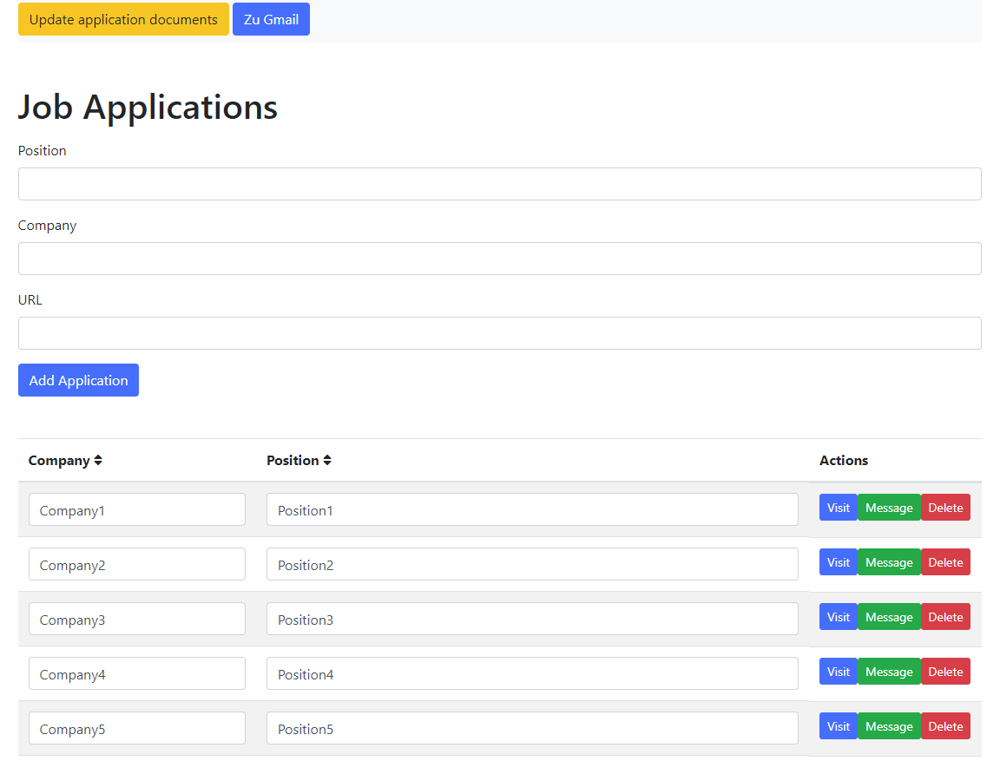
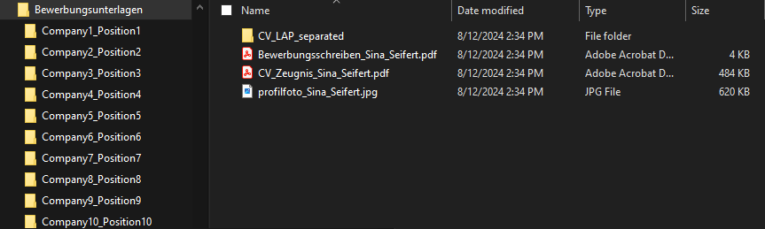

# AutoCV - Automated CV Management System

AutoCV is a Flask-based web application designed to manage job applications efficiently. The application allows users to add, display, and delete job applications, as well as generate related documents such as CVs and cover letters.



## Features

- **Job Application Management**: Add, view, and delete job applications through a web interface.
- **Automated Document Generation**: Automatically generate CVs and cover letters using pre-defined templates.
- **Data Handling**: Load, save, and manage application data in a structured format.
- **User-Friendly Interface**: Responsive design using Bootstrap and Font Awesome for a clean and intuitive user experience.

## Project Structure

- `main.py`: The entry point of the application. Initializes and runs the Flask server.
- `views.py`: Contains the routes and view functions for handling HTTP requests.
- `forms.py`: Defines the forms used for user input, such as adding new job applications.
- `data_manager.py`: Handles data operations such as loading, saving, and updating application data.
- `clean_data.py`: Utility functions for cleaning and validating data.
- `folder_manager.py`: Manages file operations including folder creation and cleanup.
- `create_application_files.py`: Generates application-related documents based on templates and user input.
- `pdf_generator.py`: Contains functions to generate PDFs from HTML templates.
- `letter_content.py`: Stores the templates and dynamic content for cover letters.
- `unterlagen_update.py`: Manages the update process for application documents.
- `data.json`: A sample data file where job applications are stored.
- `settings.json`: Contains configuration settings for the application.
- `templates/`: Directory for HTML templates used in the application.
- `static/`: Directory for static files such as CSS and JavaScript.
- `assets/`: Contains folders like `demo`, `miko`, and `Bewerbungsunterlagen` for storing generated documents and related assets.
- `.gitignore`: Specifies files and directories to be ignored by Git.
- `README.md`: This file, which provides an overview of the project and instructions for use.

## Installation

1. **Clone the repository**:
   ```bash
   git clone https://github.com/rudolphreti/autobewerbung.git
   cd autobewerbung
   ```

2. **Create a virtual environment and activate it**:
   ```bash
   python3 -m venv venv
   source venv/bin/activate
   ```

3. **Install the required packages**:
   Use the `requirements.txt` file to install all the necessary dependencies:
   ```bash
   pip install -r requirements.txt
   ```
   > The `-r requirements.txt` command tells pip to install all the packages listed in the `requirements.txt` file, ensuring that your environment has the correct dependencies to run the application.

4. **Run the application**:
   In Visual Studio Code (VS Code), you can run the application using the build command:
   - Press `Ctrl + Shift + B` to execute `main.py`.

5. **Access the application**:
   The application will automatically open in your default web browser.

## Usage

- **Adding a Job Application**: You can add application data manually, but it's better to use a web scraper to make the whole process more efficient. 
- **Viewing Applications**: The list of saved applications is displayed in a table with sorting and searching features.
- **Generating Documents**: Every time the application is run, it generates new application documents based on the data in `data.json` (position, company) and `settings.json` (user data). You can also update existing documents by triggering the "Update application documents" feature.



## TODO
* migration to .NET (what exact framework is not yet determined, it will probably be MAUI).

## License

This project is licensed under the MIT License - see the [LICENSE](LICENSE) file for details.
